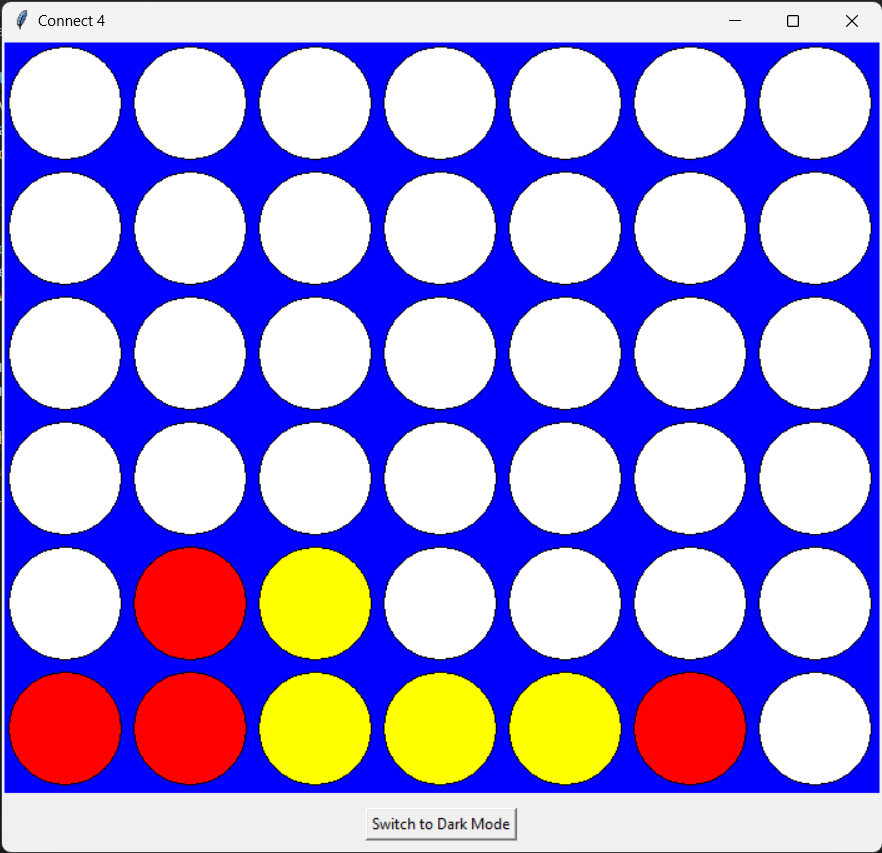
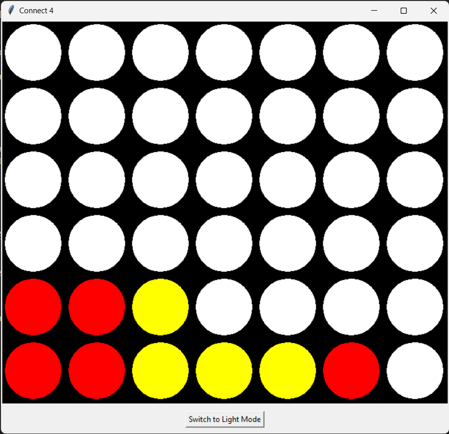

# Connect4Game

A Connect 4 game implemented in Python using the Tkinter library for the graphical user interface (GUI). The game includes features like light/dark mode and an aesthetically pleasing design.

## Features

- **Connect 4 Game Logic:** Implements the core game mechanics.
- **Graphical User Interface (GUI):** Uses Tkinter to create an interactive and visually appealing interface.
- **Light/Dark Mode:** Allows users to switch between light and dark modes for better visual comfort.

## Requirements

- Python 3
- Tkinter (usually included with standard Python distributions)
- NumPy

## Installation

1. Clone the repository:

    ```sh
    git clone https://github.com/yourusername/connect4-game.git
    ```

2. Change to the project directory:

    ```sh
    cd connect4-game
    ```

3. (Optional) Create a virtual environment:

    ```sh
    python -m venv venv
    source venv/bin/activate  # On Windows use `venv\Scripts\activate`
    ```

4. Install the required packages:

    ```sh
    pip install numpy
    ```

## Usage

1. Run the game:

    ```sh
    python connect4.py
    ```

2. The game window will open. Click on the columns to drop your pieces.

3. Use the "Switch to Dark Mode" button to toggle between light and dark modes.

## File Structure
```
connect4game/
│
├── main.py # Main Python script containing the game logic and GUI
├── README.md # This README file
```

## Screenshots

### Light Mode


### Dark Mode


## Contributing

Feel free to fork this project and submit pull requests. Any improvements and suggestions are welcome!

## License

This project is licensed under the MIT License. See the [LICENSE](LICENSE) file for more details.
